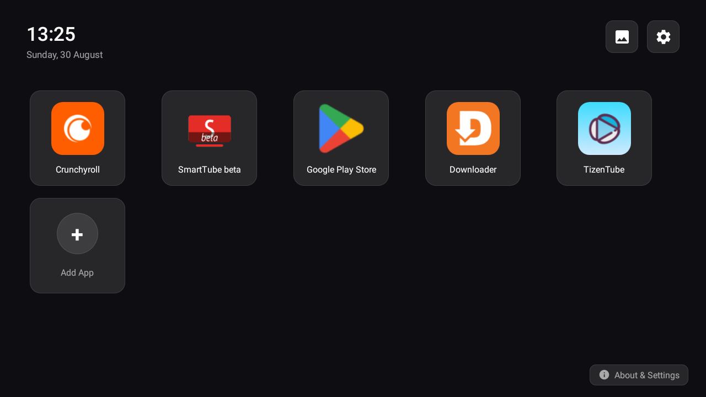
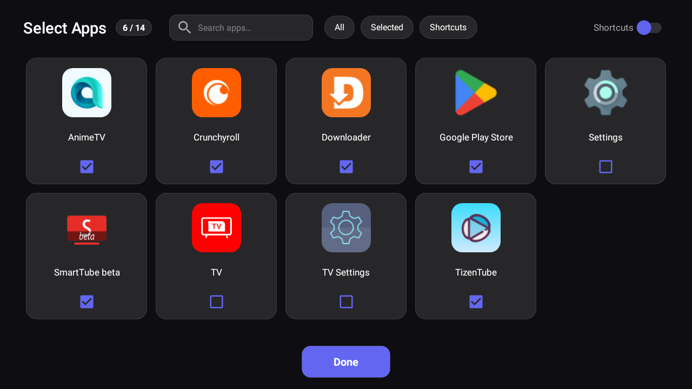

# TV Launcher

**Version 1.6.0** — A lightweight Android TV home launcher focused on low RAM use and a simple, customizable app grid. Built with AI assistance.

## Features

- **Up to 15 icons on home** — 14 apps plus a permanent **"+"** tile to add or change apps
- **Low memory** — Release builds use **~30–40 MB PSS** on the home screen (measured ~27–38 MB on a typical TV; varies by device, pinned apps, and background checks)
- **Fast app picker** — Loads the full app list in the background with a loading indicator
- **App search & filter chips** — Search as you type, plus All / Selected / Shortcuts tabs in the add-apps screen
- **App reordering & context menu** — Long-press an app for Open, Move Left, Move Right, App Info, or Remove
- **Pinned shortcuts** — Optional support for shortcuts (e.g. from Activity Launcher)
- **Long-press to remove** — Remove an app from the home screen without opening the picker
- **Stable app order** — Your home row order is saved and restored across restarts
- **Modern dark UI** — OLED-friendly theme with frosted card tiles and rounded app icons
- **Optional wallpaper engine** — Cycling online wallpapers (Wallhaven / Bing / Picsum / Reddit), a custom image URL mode, and a dim overlay (solid background by default)
- **Optional home button override** — Intercept the TV Home key on locked-down firmware via the Accessibility service (off by default)
- **Optional stock launcher RAM killer** — Stop pre-installed OEM TV launchers from holding background RAM (off by default)
- **Optional auto-updates** — Weekly check for new GitHub releases (on by default; can be disabled in About)

## Quick start

1. **Download** the APK using one of these options:
   - **Downloader app (easiest on TV)** — see [Download with Downloader](#download-with-downloader) (code **4291463**)
   - **Browser / PC** — [latest release](https://github.com/wiiguy/lightweight_androidtv_launcher/releases/latest) (release APK built by GitHub Actions when a `v*` tag is pushed)
2. **Install** (ADB example):

   ```bash
   adb connect <TV_IP>:5555
   adb install -r app-release.apk
   ```

3. **Set as default launcher** (if needed):

   ```bash
   adb shell cmd package set-home-activity com.tvlauncher/.MainActivity
   ```

Press **Home** on the remote to open the launcher.

> Use the **release** APK for everyday use. Debug builds are larger and use more RAM because R8 shrinking is disabled.

## Screenshots

**Home screen**



**App selection**



## Download with Downloader

On Fire TV, Google TV, or Android TV, the fastest way to get the APK is **[Downloader by AFTVnews](https://www.aftvnews.com/downloader/)** (install from the Amazon Appstore on Fire TV, or from Google Play on Android TV / Google TV).

1. Open **Downloader**
2. In the URL box, enter this short code and press **Go**:

   ```
   4291463
   ```

   You can also enter the full short link: `https://aftv.news/4291463` — both open the [latest `app-release.apk`](https://github.com/wiiguy/lightweight_androidtv_launcher/releases/latest/download/app-release.apk) from GitHub.
3. When the download finishes, choose **Install** (allow **Install unknown apps** for Downloader if Android asks)
4. After install, press **Home** and set TV Launcher as your home app if prompted

> The short code always tracks the **latest** GitHub release. You do not need to re-enter a new code when a new version is published.

## Install without ADB

Copy the APK to the TV (USB, network share, or file transfer), enable **Unknown sources** in Settings → Security, then open the APK with a file manager and install.

## Usage

| Action | How |
|--------|-----|
| **Add or change apps** | Focus the **"+"** tile → select → pick apps (max 14) → **Done** |
| **Launch an app** | Select its icon on the home screen |
| **App menu** | Long-press an icon → **Open**, **Move Left**, **Move Right**, **App Info**, or **Remove** |
| **Remove an app** | Long-press the icon → **Remove** |
| **Shortcuts** | Turn **Shortcuts** on in the add-apps screen; pin shortcuts from supported apps |
| **Search apps** | In the add-apps screen, type in the search field or use the All / Selected / Shortcuts chips |
| **Wallpaper** | Press the **picture** button (top-right) — solid, cycling online, or custom URL |
| **System settings** | Press the **gear** button (top-right) |
| **About & Settings** | Focus **About & Settings** (bottom-right) — version, GitHub link, update options, home override & RAM killer toggles |

### About & Settings screen

| Option | What it does |
|--------|----------------|
| **Open GitHub** | Opens the project repository in a browser |
| **Check for updates** | Checks GitHub now, downloads if newer, then prompts to install *(GitHub build only)* |
| **Automatic weekly updates** | Toggle (default **on**). When on, Android schedules a background check about every 7 days while online *(GitHub build only)* |
| **Override TV default launcher** | Toggle (default **off**). Intercepts the Home key on devices that lock the default launcher; requires enabling the Accessibility service |
| **Kill stock launcher RAM** | Toggle (default **off**). Stops pre-installed OEM TV launchers from holding background RAM (with a confirmation prompt) |
| **Close** | Dismiss the dialog |

## Build from source

Requires JDK 17 and the Android SDK (API 34).

```bash
./gradlew assembleGithubRelease   # GitHub build with in-app updater (recommended)
./gradlew assembleFdroidRelease    # F-Droid build without the in-app updater
./gradlew assembleGithubDebug      # faster debug builds, higher RAM on device
./gradlew test                     # unit tests
./gradlew lint                     # lint checks
```

The app ships in two flavors:
- **`github`** — what GitHub users install; includes the automatic weekly updater that downloads new releases from GitHub.
- **`fdroid`** — built from the same source for the F-Droid repo; the in-app updater is compiled out (updates come through F-Droid), and `REQUEST_INSTALL_PACKAGES` is not requested.

GitHub release APK: `app/build/outputs/apk/github/release/app-github-release.apk` (uploaded to releases as `app-release.apk`).

Pushing a tag like `v1.6.0` triggers the [release workflow](.github/workflows/release.yml) to build and publish a signed APK. The workflow sets `versionName` and `versionCode` from the tag (e.g. `v1.6.0` → `1.6.0` / `10600`) and verifies the APK before upload (requires signing secrets in the repo).

## Requirements

- Android 5.0+ (API 21)
- Android TV or TV box with leanback support
- Permissions:
  - `QUERY_ALL_PACKAGES` — discover installed apps
  - `INTERNET` — update check and APK download from GitHub (only when checking or updating)
  - `REQUEST_INSTALL_PACKAGES` — install downloaded updates (you approve the system install screen) *(GitHub build only)*

## Automatic updates

When **Automatic weekly updates** is enabled (default), the app uses **Android WorkManager** to run an update check about **every 7 days** while the device has a network connection. It is not a fixed clock time (e.g. “every Monday”); the OS decides when to run the job.

1. Fetches the [latest GitHub release](https://github.com/wiiguy/lightweight_androidtv_launcher/releases/latest)
2. Compares the release tag to the installed version (e.g. `v1.6` vs `1.5`)
3. If newer, downloads `app-release.apk` from the release assets
4. Shows an **Install** dialog — you must still confirm on the TV (no silent install without root)

**Notes:**

- Allow **Install unknown apps** for TV Launcher when prompted.
- Turn off background checks: **About** → disable **Automatic weekly updates**. This cancels the scheduled job and reduces background activity; **Check for updates** still works manually.
- Updates only appear after a release is published on GitHub with `app-release.apk` attached.

## Memory notes

Measured on a typical Android TV (release build, home screen, ~6–8 pinned apps; values are `TOTAL PSS`):

| Configuration | Approx. PSS |
|---------------|-------------|
| Release, auto-update **off** | **~25–30 MB** |
| Release, auto-update **on** (default) | **~30–40 MB** (falls to ~27 MB after a fresh start; WorkManager + extra code load it a bit) |
| + Home button override **on** | **~45–50 MB** (accessibility service keeps the process resident) |
| + Cycling online wallpaper | **~55–60 MB** on 1080p sets (full-screen bitmap) |

RAM also depends on how many apps are pinned and whether the add-apps screen was opened recently. The override and wallpaper features are off by default, keeping the default configuration lean.

To check on a connected device:

```bash
adb shell dumpsys meminfo com.tvlauncher | grep "TOTAL PSS"
```

## Credits

This release includes significant contributions from **[Jiten Dhull](https://github.com/jitendhull)** (PR #3). Thanks for the modernized UI and the new TV features:

- **Modern dark UI** — OLED-friendly palette (#0E0E12), frosted card tiles, larger app icons with rounded corners
- **App reordering & context menu** — long-press an app to Move Left / Move Right, open App Info, or Remove
- **Home button override** — optional, off by default; accessibility-based service that intercepts the TV Home key on locked-down firmware (Google TV / Fire TV / Xiaomi)
- **Stock launcher RAM killer** — optional, off by default; stops pre-installed OEM TV launchers from hogging background RAM
- **Real-time app search & filter chips** — All / Selected / Shortcuts tabs in the add-apps screen
- **Wallpaper engine** — optional, off by default (solid by default); cycling online wallpapers (Wallhaven / Bing / Picsum / Reddit), custom image URLs, and a dim overlay
- **Adapter performance** — DiffUtil-based ListAdapter swaps that remove full `notifyDataSetChanged` refreshes

## License

Licensed under the [GNU General Public License v3.0](LICENSE) (GPL-3.0).
